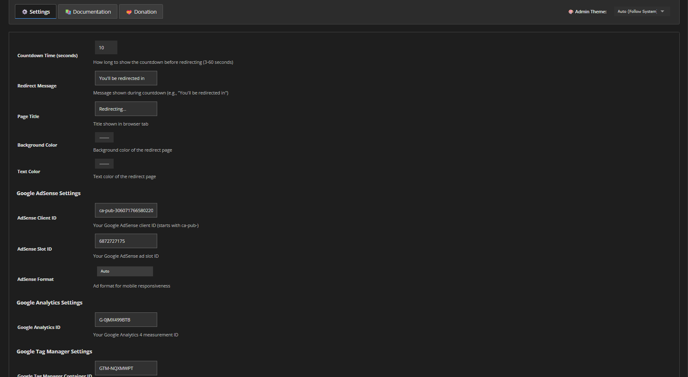

# Ultimate Ad Redirect Plugin for YOURLS

**Version:** 2.0  
**Author:** Master3395  
**License:** MIT  
**YOURLS Compatibility:** 1.10.0+ (Tested with YOURLS 1.10.2)

The most advanced and feature-rich redirect plugin for YOURLS with customizable ads, countdown timer, and comprehensive analytics.

## 📸 Screenshots

*Clean tabbed interface with theme toggler and comprehensive settings*

[View all screenshots →](guides/screenshots.md)

## 🚀 Quick Start

### Installation
1. Upload the plugin folder to `/user/plugins/`
2. Activate the plugin in your YOURLS admin panel
3. Configure settings in "Ultimate Ad Redirect" page
4. Test with a short URL

[Detailed Installation Guide →](guides/installation.md)

### Basic Setup
1. Set countdown time (3-60 seconds)
2. Add your AdSense Client ID and Slot ID (optional)
3. Configure colors and messages
4. Save and test!

[Complete Configuration Guide →](guides/configuration.md)

## ✨ Key Features

- **Smart Redirect Logic** - Only redirects on actual short URL visits
- **Customizable Countdown** - 3-60 second timer with progress bar
- **Google AdSense Integration** - Full support with multiple ad formats
- **Analytics & Tracking** - GA4, GTM, and detailed logging
- **Mobile-First Design** - Fully responsive and optimized
- **Theme Support** - Light, Dark, and Auto themes
- **Live Preview** - See changes in real-time
- **Security Features** - XSS/CSRF protection, input validation

[View All Features →](guides/features.md)

## 📚 Documentation

- [Installation Guide](guides/installation.md)
- [Configuration Guide](guides/configuration.md)
- [Features Overview](guides/features.md)
- [Troubleshooting](guides/troubleshooting.md)
- [API Documentation](guides/api.md)
- [Changelog](guides/changelog.md)

## 🛠️ Compatibility

- **YOURLS:** 1.10.0+
- **PHP:** 7.4+ (Recommended: 8.0+)
- **Web Servers:** Apache, Nginx, OpenLiteSpeed
- **Tested:** YOURLS 1.10.2 on AlmaLinux 9.6 with OpenLiteSpeed

## 💝 Support & Contribution

- **Issues:** [GitHub Issues](https://github.com/master3395/YOURLS-Ultimate-Ad-Redirect/issues)
- **Donate:** Support development via [PayPal](https://www.paypal.com/paypalme/master3395) or [Stripe](https://donate.stripe.com/yourlink)
- **Discord:** [Join our community](https://discord.gg/nx9Kzrk)

## 👨‍💻 Author

**Master3395**
- Website: [newstargeted.com](https://newstargeted.com/)
- Email: info@newstargeted.com
- GitHub: [@master3395](https://github.com/master3395)

## 📄 License

MIT License - Free to modify and distribute. See [LICENSE](LICENSE) for details.

---

**Need help?** Check our [troubleshooting guide](guides/troubleshooting.md) or contact us via email or Discord.
