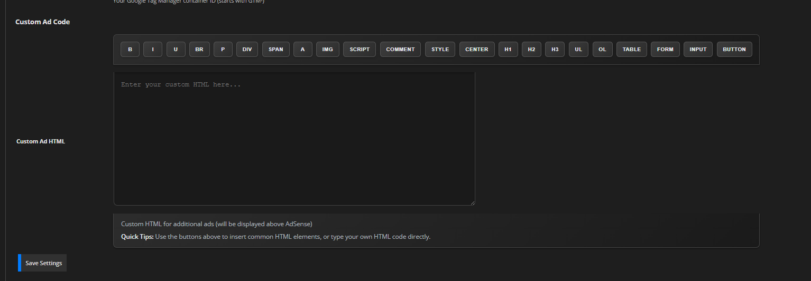
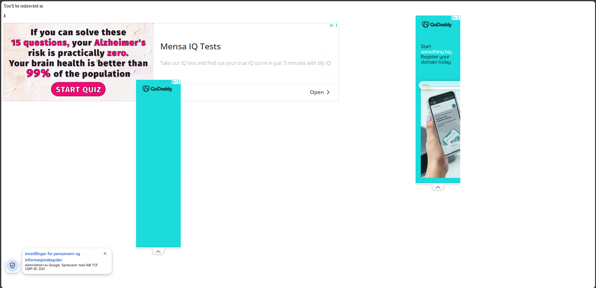

# Ultimate Ad Redirect Plugin for YOURLS
[](https://github.com/YOURLS/awesome)
**Version:** 2.0  
**Author:** Master3395  
**License:** MIT  
**Repository:** [GitHub - YOURLS-Ultimate-Ad-Redirect](https://github.com/master3395/YOURLS-Ultimate-Ad-Redirect)  
**Author Website:** [newstargeted.com](https://newstargeted.com/)  
**YOURLS Compatibility:** 1.10.0+ (Tested with YOURLS 1.10.2)
The most advanced and feature-rich redirect plugin for YOURLS with customizable ads, countdown timer, and comprehensive analytics.
## 📸 Screenshots
### Admin Interface

*Clean tabbed interface with theme toggler and comprehensive settings*
### Settings Configuration

*Complete settings panel with all configuration options*
### Documentation & Resources

*Helpful documentation with direct links to AdSense, Analytics, and setup guides*
### Preview & Testing

*Live preview showing how your redirect page will appear to users*
## 🚀 Features
### Core Functionality
- **Smart Redirect Logic**: Only redirects on actual short URL visits, not admin activation
- **Preview Mode**: Shows preview when activating plugin in admin
- **Customizable Countdown**: 3-60 second countdown timer
- **Mobile-First Design**: Fully responsive and mobile-optimized
- **SEO Friendly**: Proper meta tags and robots directives
### Advertisement Management
- **Pre-configured AdSense**: Comes with default AdSense settings ready to use
- **Google AdSense Integration**: Full AdSense support with customizable slots
- **Google Tag Manager**: Complete GTM integration for advanced tracking
- **Custom Ad HTML**: Add your own custom ad code with built-in HTML editor
- **Default Ad Fallback**: Beautiful default ads when no custom ads configured
- **Multiple Ad Formats**: Support for auto, rectangle, vertical, and horizontal formats
- **Helpful Links**: Direct links to get AdSense IDs, create ad units, and more
### Analytics & Tracking
- **Google Analytics 4**: Full GA4 integration
- **Google Tag Manager**: Advanced tracking and tag management
- **Redirect Logging**: Detailed logs of all redirects
- **IP Tracking**: Track unique visitors
- **Referrer Analysis**: See where your traffic comes from
- **Real-time Stats**: View statistics in admin panel
### Admin Interface Features
- **Tabbed Interface**: Clean settings tab, comprehensive documentation tab, and donation tab
- **Theme Toggler**: Switch between light, dark, and auto themes
- **Live Preview**: See how your redirect page will look
- **Color Customization**: Customize background and text colors
- **Message Customization**: Customize countdown messages
- **Donation Support**: Support plugin development with PayPal or Stripe
- **Security Features**: Input validation and sanitization
## 📊 Features Comparison
| Feature | Basic Redirect | Ultimate Ad Redirect |
|---------|----------------|---------------------|
| **Countdown Timer** | ❌ | ✅ 3-60 seconds |
| **AdSense Integration** | ❌ | ✅ Full support |
| **Google Analytics** | ❌ | ✅ GA4 + GTM |
| **Custom Ads** | ❌ | ✅ HTML editor |
| **Mobile Responsive** | ❌ | ✅ Mobile-first |
| **Live Preview** | ❌ | ✅ Real-time |
| **Analytics Dashboard** | ❌ | ✅ Complete stats |
| **Theme Support** | ❌ | ✅ Light/Dark/Auto |
| **Security Features** | ❌ | ✅ XSS/CSRF protection |
| **Modular Code** | ❌ | ✅ 13 modules |
## 📁 File Structure
```
Ultimate-Ad-Redirect/
+-- plugin.php                 # Main plugin file (40 lines)
+-- modules/
�   +-- admin-settings.php     # Admin settings and configuration (518 lines)
�   +-- redirect-handler.php   # Main redirect logic (334 lines)
�   +-- ad-manager.php         # Advertisement management (153 lines)
�   +-- analytics.php          # Analytics and tracking (200 lines)
+-- logs/
�   +-- redirects.log          # Redirect tracking log
+-- README.md                  # This file
```
## 🛠️ Compatibility
- **YOURLS Version:** 1.10.0 and above
- **PHP Version:** 7.4+ (Recommended: PHP 8.0+)
- **Web Servers:** Apache, Nginx, OpenLiteSpeed (OLS)
- **Operating Systems:** Linux, Windows, macOS
- **Tested With:** YOURLS 1.10.2 on AlmaLinux 9.6 with OpenLiteSpeed
## 🛠️ Installation
1. **Upload**: Copy the plugin folder to `/user/plugins/`
2. **Activate**: Enable the plugin in your YOURLS admin panel
3. **Configure**: Go to "Ultimate Ad Redirect" settings page
4. **Test**: Create a short URL and test the redirect
## 🚀 Quick Setup Guide
### Step 1: Basic Configuration
1. Set your **countdown time** (3-60 seconds)
2. Customize your **redirect message** and **page title**
3. Choose your **colors** (background and text)
4. Select your **admin theme** preference
### Step 2: AdSense Setup (Optional)
1. Get your **AdSense Client ID** from [Google AdSense](https://www.google.com/adsense/)
2. Create an **ad unit** and get your **Slot ID**
3. Choose your **ad format** (Auto recommended)
4. Test your ads with the preview
### Step 3: Analytics Setup (Optional)
1. Set up **Google Analytics 4** and get your **GA4 ID**
2. Configure **Google Tag Manager** if needed
3. Add **custom ad HTML** if desired
### Step 4: Test & Deploy
1. Use the **live preview** to test your settings
2. Create a test short URL
3. Verify everything works correctly
4. Go live with your redirects!
## ⚙️ Configuration
### Admin Interface Overview
The plugin features a clean, tabbed interface with three main sections:
- **⚙️ Settings Tab**: Complete configuration panel
- **📚 Documentation Tab**: Helpful links and setup guides
- **💝 Donation Tab**: Support plugin development
### Basic Settings
| Setting | Description | Default | Range |
|---------|-------------|---------|-------|
| **Countdown Time** | How long to show countdown before redirect | 10 seconds | 3-60 seconds |
| **Redirect Message** | Message shown during countdown | "You'll be redirected in" | Custom text |
| **Page Title** | Browser tab title | "Redirecting..." | Custom text |
| **Background Color** | Page background color | #1a1a1a | Any hex color |
| **Text Color** | Text color on page | #ffffff | Any hex color |
| **Admin Theme** | Admin interface theme | Auto | Light/Dark/Auto |
### Google AdSense Settings
| Setting | Description | Format | Required |
|---------|-------------|--------|----------|
| **Client ID** | Your AdSense publisher ID | ca-pub-xxxxxxxxxxxxxxxx | Yes |
| **Slot ID** | Your ad unit slot ID | 1234567890 | Yes |
| **Ad Format** | Ad display format | Auto/Rectangle/Vertical/Horizontal | Yes |
**Ad Format Options:**
- **Auto**: Automatically adjusts based on screen size
- **Rectangle**: 300x250px standard rectangle
- **Vertical**: 160x600px skyscraper
- **Horizontal**: 728x90px leaderboard
### Analytics & Tracking
| Service | Setting | Description | Format |
|---------|---------|-------------|--------|
| **Google Analytics 4** | GA4 ID | Measurement ID for tracking | G-XXXXXXXXXX |
| **Google Tag Manager** | GTM Container ID | Container for advanced tracking | GTM-XXXXXXX |
### Custom Ad Code
- **HTML Editor**: Built-in editor with formatting buttons
- **Custom HTML**: Add your own ad code, banners, or content
- **Position**: Custom ads appear above AdSense ads
- **Validation**: HTML is validated and sanitized for security
### Preview Mode
- **Live Preview**: See exactly how your redirect page will look
- **Real-time Updates**: Preview updates as you change settings
- **Color Testing**: Test different color combinations instantly
- **Mobile Preview**: Responsive design preview
## 🔒 Security Features
- **Input Validation**: All user inputs are validated and sanitized
- **XSS Protection**: Output is properly escaped
- **CSRF Protection**: Nonce verification for all forms
- **SQL Injection Prevention**: Proper data sanitization
- **File Permission Security**: Logs directory has proper permissions
## 📊 Analytics
The plugin tracks:
- Total redirects
- Unique IP addresses
- Top referrers
- Recent redirect activity
- User agent information
View analytics in the admin panel under "Ultimate Ad Redirect" settings.
## 🎨 Customization
### Styling
The redirect page uses modern CSS with:
- Gradient backgrounds
- Smooth animations
- Mobile-responsive design
- Custom color schemes
- Progress bars
- Hover effects
### JavaScript Features
- Smooth countdown animation
- Progress bar animation
- Skip button functionality
- Keyboard support (Enter/Space to skip)
- Mobile touch support
## 🐛 Troubleshooting
### Common Issues
| Problem | Solution |
|---------|----------|
| **Plugin not redirecting** | Check if plugin is activated and settings are saved |
| **Ads not showing** | Verify AdSense IDs are correct and account is approved |
| **Analytics not tracking** | Confirm GA4 ID format (G-XXXXXXXXXX) and setup |
| **Preview not working** | Clear browser cache and check for JavaScript errors |
| **Colors not applying** | Ensure hex color format (#ffffff) is used |
| **Countdown not starting** | Check if countdown time is between 3-60 seconds |
### Debug Steps
1. **Check Logs**: Look in `/logs/` directory for error messages
2. **Browser Console**: Check for JavaScript errors (F12)
3. **Network Tab**: Verify tracking requests are being sent
4. **File Permissions**: Ensure logs directory is writable (755)
5. **Plugin Status**: Confirm plugin is active in YOURLS admin
## 📝 Changelog
### Version 2.0
- Complete rewrite with modular architecture
- Added comprehensive admin settings with tabbed interface
- Integrated Google AdSense and Analytics
- Added Google Tag Manager support
- Added mobile-first responsive design
- Implemented security features
- Added analytics and logging
- Created preview mode for admin activation
- Added helpful documentation tab with all resources
### Version 1.5 (Previous)
- Basic redirect functionality
- Simple countdown timer
- Basic ad display
## 👨‍💻 Author
**Master3395**
- Website: https://newstargeted.com/
- Email: info@newstargeted.com
- Discord: https://discord.gg/nx9Kzrk
- GitHub: https://github.com/master3395
## 📄 License
MIT License - Feel free to modify and distribute.
## 🤝 Support
For support, feature requests, or bug reports:
1. Check the troubleshooting section above
2. Review the logs in the `/logs/` directory
3. Contact the author via email or GitHub

**Note**: This plugin is designed to be the ultimate YOURLS redirect solution with enterprise-level features while maintaining ease of use for beginners.