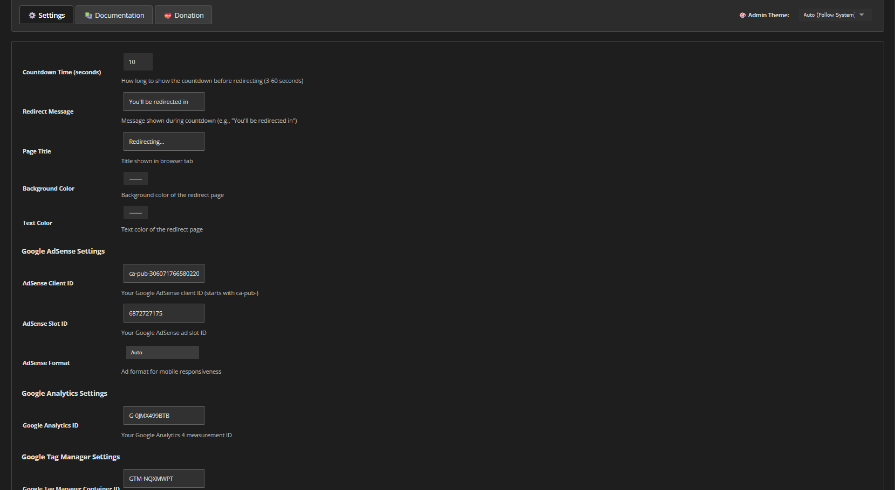
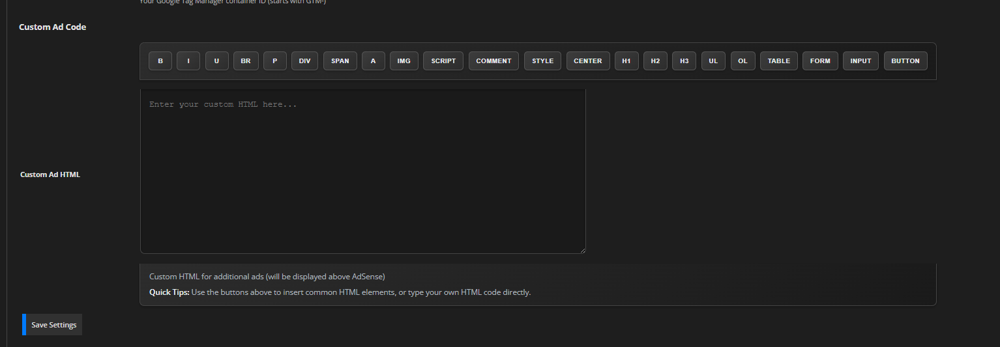
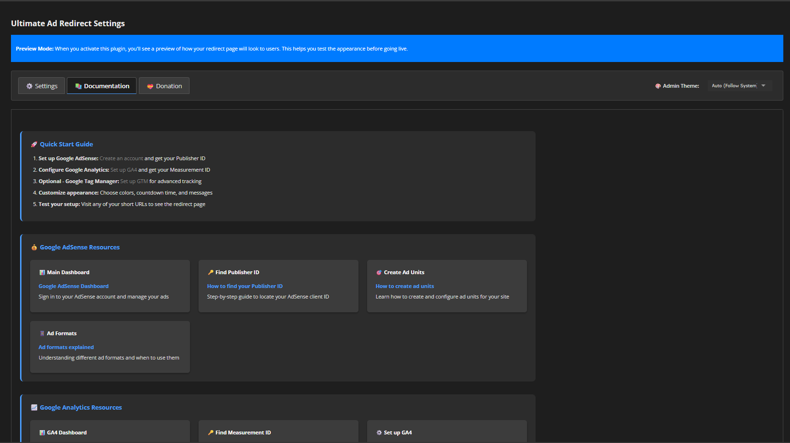
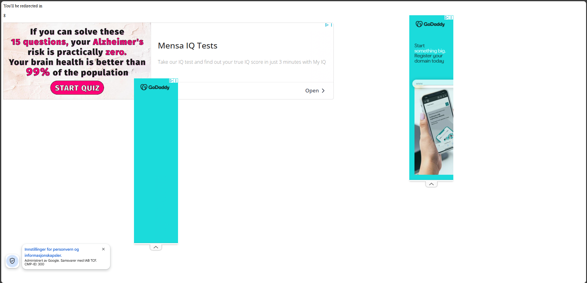

# Screenshots

Visual guide to Ultimate Ad Redirect plugin interface and features.

## Admin Interface

### Main Settings Page



**Features Shown:**
- Clean tabbed interface
- Theme toggler (Light/Dark/Auto)
- Settings, Documentation, and Donation tabs
- Professional design
- Easy navigation

---

### Settings Tab - Configuration Panel



**Features Shown:**
- Countdown time slider (3-60 seconds)
- Color pickers for background and text
- AdSense configuration fields
- Google Analytics settings
- Custom HTML editor
- Theme selector
- Save settings button

**Configuration Options:**
1. **Basic Settings**
   - Countdown time
   - Redirect message
   - Page title

2. **Visual Settings**
   - Background color
   - Text color
   - Admin theme

3. **AdSense Settings**
   - Client ID
   - Slot ID
   - Ad format

4. **Analytics**
   - GA4 Measurement ID
   - GTM Container ID

5. **Custom Ads**
   - HTML editor
   - Format buttons
   - Code preview

---

### Documentation Tab - Helpful Resources



**Features Shown:**
- Quick links to external resources
- Direct links to AdSense setup
- Google Analytics configuration
- Tag Manager setup
- YOURLS documentation
- Support links

**Available Links:**
- 📝 Get AdSense Client ID
- 🎯 Create Ad Unit
- 📊 Google Analytics Setup
- 🏷️ Tag Manager Setup
- 📚 YOURLS Documentation
- 💬 Support Discord
- 🌐 Plugin GitHub
- 👤 Author Website

---

### Preview Mode - Live Preview



**Features Shown:**
- Real countdown timer
- Actual color scheme
- Ad placement preview
- Progress bar animation
- Skip button
- Responsive design

**What You See:**
1. **Page Title** - Custom or default
2. **Countdown Display** - Large, clear numbers
3. **Progress Bar** - Visual countdown
4. **Message** - Custom redirect message
5. **Advertisements** - AdSense or custom ads
6. **Skip Button** - Optional skip functionality

---

## User Experience

### Desktop View

**Features:**
- Large, readable countdown
- Clear progress indicator
- Prominent skip button
- Well-placed advertisements
- Clean, modern design
- Fast loading

**Desktop Layout:**
```
┌─────────────────────────────┐
│      Page Title             │
│                             │
│    [Countdown: 10]          │
│    [Progress Bar ████░░░]   │
│                             │
│    Redirect Message         │
│                             │
│    [Advertisement Area]     │
│                             │
│    [Skip Button]            │
└─────────────────────────────┘
```

### Mobile View

**Optimized For:**
- Small screens
- Touch interactions
- Fast loading
- Minimal data usage

**Mobile Layout:**
```
┌───────────────┐
│  Page Title   │
│               │
│ [Count: 10]   │
│ [Progress ██] │
│               │
│ Message       │
│               │
│ [Ad Area]     │
│               │
│ [Skip Btn]    │
└───────────────┘
```

---

## Theme Examples

### Light Theme

**Characteristics:**
- Bright background
- Dark text
- High contrast
- Easy reading in daylight

**Colors:**
- Background: Light gray or white
- Text: Dark gray or black
- Buttons: Blue or custom
- Progress: Green or blue

### Dark Theme

**Characteristics:**
- Dark background
- Light text
- Reduced eye strain
- Night-time friendly

**Colors:**
- Background: Dark gray or black
- Text: Light gray or white
- Buttons: Blue or custom
- Progress: Green or blue

### Auto Theme

**Characteristics:**
- Matches system preference
- Automatic switching
- Best of both worlds
- User-preferred setting

**Behavior:**
- Light mode during day
- Dark mode at night
- Follows OS settings
- No manual switching needed

---

## Different Ad Formats

### Auto Format (Responsive)

**Adapts To:**
- Screen size
- Device type
- Available space
- Optimal placement

**Display:**
- Desktop: Large rectangle or leaderboard
- Tablet: Medium rectangle
- Mobile: Mobile banner

### Rectangle Format (300x250)

**Best For:**
- Standard placements
- Desktop and tablet
- Good visibility
- High engagement

### Vertical Format (160x600)

**Best For:**
- Sidebar placements
- Desktop only
- Long-form content
- Skyscraper ads

### Horizontal Format (728x90)

**Best For:**
- Top/bottom placement
- Desktop only
- Leaderboard position
- Wide screens

---

## Admin Themes

### Light Theme Admin

**Perfect For:**
- Daylight work
- Bright environments
- High contrast preference
- Traditional look

### Dark Theme Admin

**Perfect For:**
- Night work
- Low light environments
- Reduced eye strain
- Modern look

### Auto Theme Admin

**Perfect For:**
- All-day work
- Automatic switching
- Best user experience
- Adaptive interface

---

## Color Customization Examples

### Example 1: Default Dark
```
Background: #1a1a1a (Dark gray)
Text: #ffffff (White)
Result: High contrast, easy reading
```

### Example 2: Ocean Blue
```
Background: #0066cc (Blue)
Text: #ffffff (White)
Result: Professional, calming
```

### Example 3: Forest Green
```
Background: #006400 (Dark green)
Text: #ffffff (White)
Result: Natural, easy on eyes
```

### Example 4: Clean White
```
Background: #ffffff (White)
Text: #000000 (Black)
Result: Minimal, high contrast
```

---

## Interactive Elements

### Countdown Timer

**Features:**
- Large, clear numbers
- Smooth animation
- Real-time updates
- Automatic decrement

**States:**
- Starting (e.g., 10)
- Counting (9, 8, 7...)
- Finishing (3, 2, 1)
- Redirecting (0)

### Progress Bar

**Features:**
- Visual countdown
- Smooth animation
- Color-coded
- Percentage-based

**Progression:**
```
Start:  [██████████] 100%
Middle: [█████░░░░░]  50%
End:    [██░░░░░░░░]  20%
Done:   [░░░░░░░░░░]   0%
```

### Skip Button

**Features:**
- Always visible
- Prominent placement
- Touch-friendly
- Keyboard support

**Interaction:**
- Click: Immediate redirect
- Enter: Immediate redirect
- Space: Immediate redirect
- Touch: Immediate redirect

---

## Additional Screenshots

For more screenshots and examples:
- Visit [plugin repository](https://github.com/master3395/YOURLS-Ultimate-Ad-Redirect)
- Join [Discord community](https://discord.gg/nx9Kzrk)
- Check [author website](https://newstargeted.com/)

---

## Need Help?

- [Installation Guide](installation.md)
- [Configuration Guide](configuration.md)
- [Troubleshooting](troubleshooting.md)
- [Features Overview](features.md)

